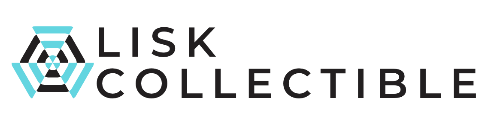
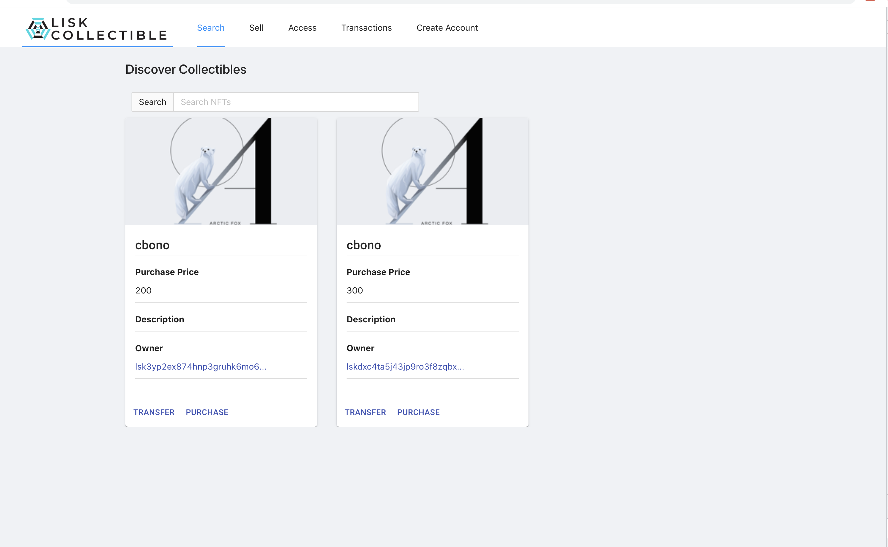
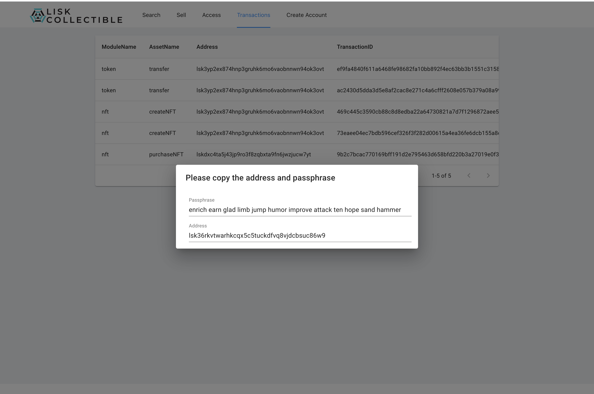
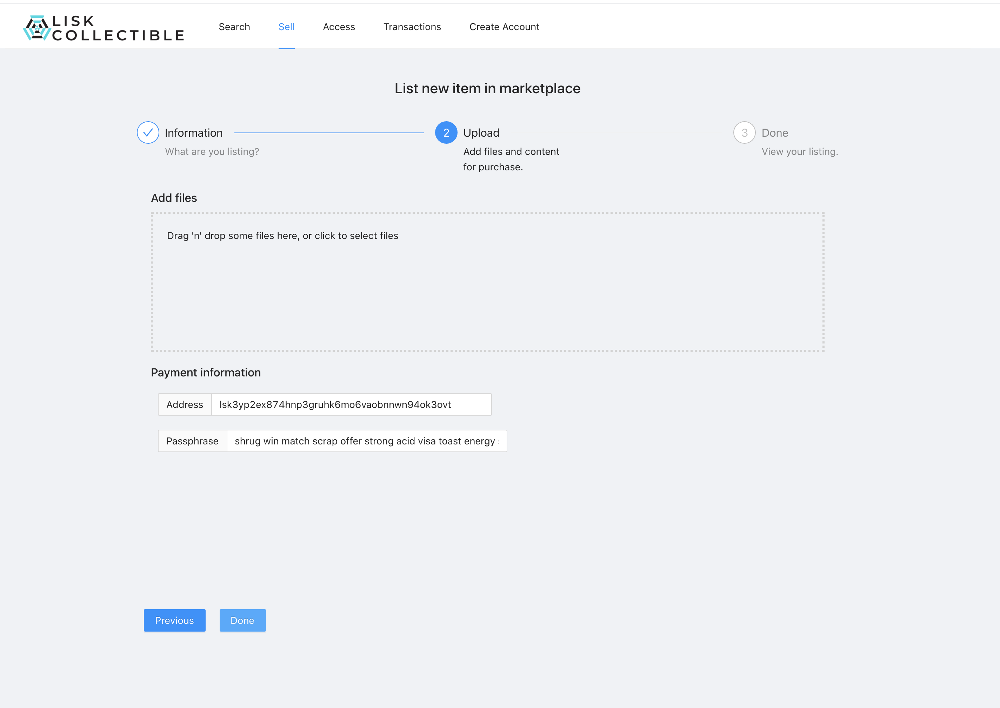
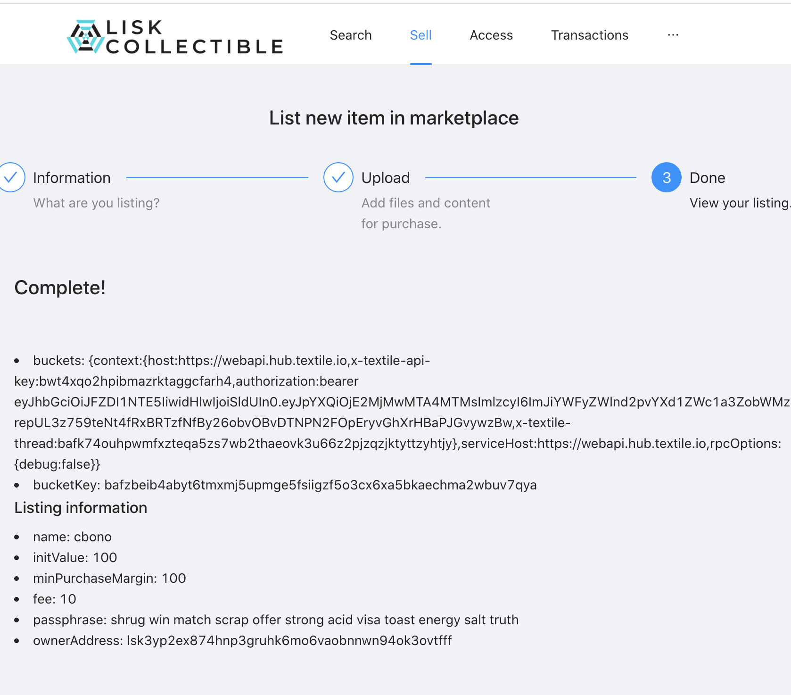
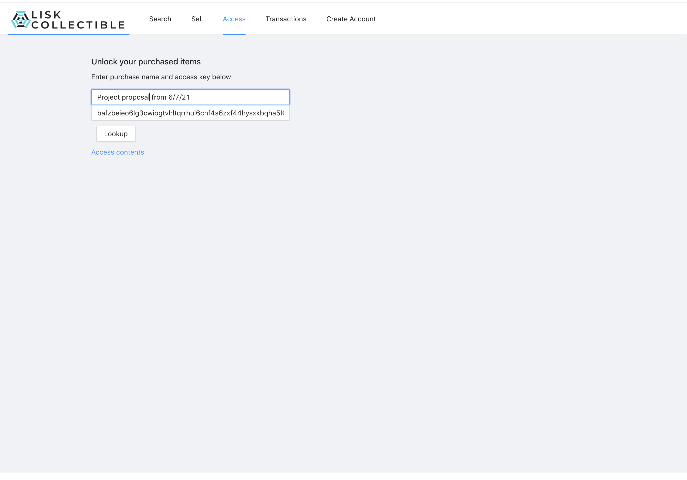
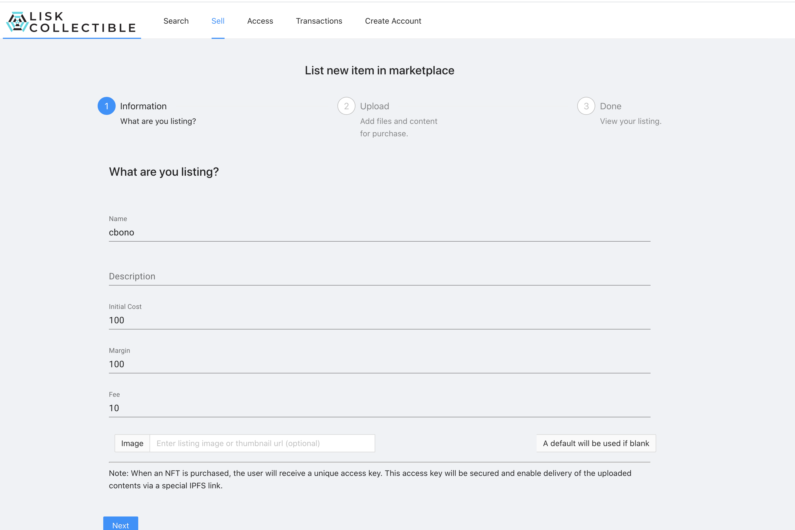

 

    

 
 

## LiskCollectible

LiskCollectible is a prototype/demo application that enables users to sell groups of documents or digital property as ownable NFTs backed by Lisk.

In progress.
## Inspiration

For any new product, the associated intellectual property will often have been touched by many actors: founders; employees; contractors; educational institutions; government funding agencies; third party licensors of technology and IP rights; and customers, including those involved in beta testing and pre-launch activities. For each of these actors, there should be written agreements in place to cover moral rights, retention of rights to background technology, any restrictions on exploiting the IP, and the scope of the licenses that are granted. In addition, joint ownership creates special challenges.

Recently there's been a lot of discussion around the value of NFT's for collecting/speculation purposes, however NFTs can offer several more practical use cases.

For written or digital media, it can be difficult to prove the ownership of a particular idea. LiskCollectible is an app that enables uses to create NFT's that can be associated with a collection of documents or media - whoever owns the NFT can demonstrate proof of ownership over such content.

Recent NFT sale: https://www.theverge.com/2021/3/11/22325054/beeple-christies-nft-sale-cost-everydays-69-million

### Running the project

This app uses Lisk (for NFT generation) and Textile (for IPFS hosting/bundling).
Textile hub key
Define `REACT_APP_TEXTILE_KEY=XXX` in your environment
`yarn && yarn start` for both the backend and front end.

## How we built it

- Reactjs based front end based using elements from the Lisk base NFT application.
- Textile: IPFS packaging of content and media files.
- Lisk: Backend for NFT issuance and enforcement.

## What we learned

- How to manage and create NFT's using the Lisk SDK.
- Tie a lisk NFT to a created bundle of documents hosted on IPFS.

## Testing / User Flow

- Start front end and back end projects.
- Click create account
- Send funds from genesis (note if the blockchain is restarted, you'll need to create a new account)
- Upload a new bundle of documents, note the information on the newly created listing.
- Return to the main marketplace home page - the NFT you created should be uploaded and available for purchase.
- Purchase the NFT, you should receive an access key.
- Enter the access key on the `Access` tab to receive an IPFS link to the purchased item/file collection.

### Screenshots

<h2>Discover NFT's</h2>

<h2>Create new marketplace account (Lisk credentials)</h2>

<h2>Upload files to be bundled</h2>

<h2>Purchase complete</h2>

<h2>Access uploaded content</h2>

<h2>Create new listing<h2>

<!-- 
Demo flow:
* NFT growth: https://www.theverge.com/2021/3/11/22325054/beeple-christies-nft-sale-cost-everydays-69-million
* LiskCollectible
* Find existing bundles - these are examples
* Search
* Upload a new collection
* Add custom file
* Access
* Download file after access
-->
